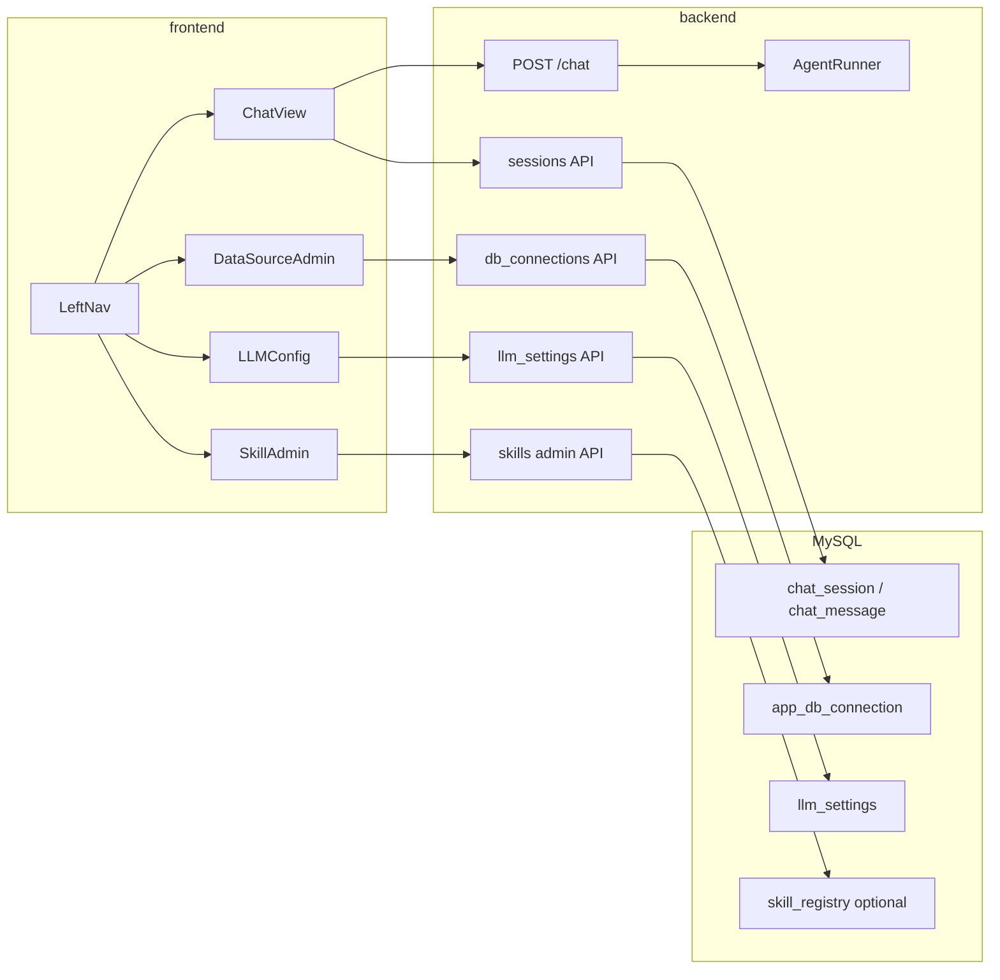

# 会话记忆 + 左侧管理导航实施计划

> 本文档为仓库内事实源；Cursor 可能在 `.cursor/plans/` 生成副本，以本文件为准。

## 概述

在保留现有 SSE / Agent 链路的前提下，引入持久化会话与多页面前端壳：左侧导航串联「对话」「技能」「数据源连接」「LLM 配置」；后端扩展会话 CRUD、配置存储与连接测试；并让 Skill 执行与 LLM 调用能读取运行时配置（而非仅 .env）。

## 现状摘要

- **上下文**：`backend/main.py` 的 `ChatRequest` 已包含 `history`，`backend/agent/runner.py` / `planner.py` 将 `system_prompt + history + 当前用户消息` 传给 LiteLLM；会话记忆在链路层面已具备。
- **缺口**：`frontend/src/hooks/useChat.ts` 只在内存中保留最近 10 条 `role/content`，刷新即丢失；无 `session_id`，无法切换历史会话。
- **数据源**：`skills/_shared/db.py` 仅从环境变量读 MySQL；`database/init.sql` 里的 `data_source_config` 是**语义层目录表**，不是可登录的数据库连接配置，需要**新建连接表**承载 host/port/user/password。
- **规则冲突**：`AGENTS.md` 写明 Skill 仅通过 `skills/<name>/SKILL.md` 维护。产品侧「页面增删改 Skill」需要明确：**管理 UI 要么直接读写仓库内 SKILL.md（适合单机 Demo），要么引入 DB 注册表 + 可选同步磁盘**。本计划默认 **DB 存启用状态与元数据 + 后端 API 读写 SKILL.md 正文**（Demo 常用）；若要求「完全不碰 Git 工作区」，需改为「Skill 正文仅存 DB」——会牵动 `prompt_builder.scan_skills` 的数据来源。

## 目标架构（增量）

## 一、会话（Session）与多轮记忆

**数据模型**（建议扩展 `database/init.sql`：增加 `chat_session`、`chat_message`；亦可单独库，Demo 阶段可与业务库同实例）

- `chat_session`：`id`、`title`（可由首条用户消息自动生成）、`created_at`、`updated_at`。
- `chat_message`：`id`、`session_id`、`role`、`content`（TEXT）、`payload_json`（可选，存 thinking/chart/kpi 等前端回放结构，JSON）。

**API**（新建路由模块如 `backend/routes/sessions.py`，由 `backend/main.py` `include_router`，单文件 &lt;300 行）

- `GET /sessions`：列表（按 `updated_at` 倒序）。
- `POST /sessions`：创建空会话，返回 `id`。
- `GET /sessions/{id}/messages`：拉取完整消息（供切换会话）。
- `PATCH /sessions/{id}`：改标题。
- `DELETE /sessions/{id}`：级联删消息。

**聊天接口扩展**

- `ChatRequest` 增加可选 `session_id: str | null`。
- 流式结束后将本轮 user 与 assistant 的最终内容写入 `chat_message`。
- **发给模型的 history**：从 DB 按序组装 `{role, content}`；限制条数/Token；助手侧以纯文本 `content` 进 LLM，图表仅前端展示。

**前端**

- 引入 `react-router-dom`，布局为左侧固定导航 + 右侧内容区。
- `useChat` 增加 `sessionId`，`sendMessage` 带 `session_id`；切换会话时 GET 消息并还原列表。
- 「新对话」= `POST /sessions` 后切换到新会话。

## 二、左侧导航与三个管理页

**路由与布局**（将 `App.tsx` 拆为 layout + `frontend/src/pages/`）

| 路径 | 页面 |
|------|------|
| `/` | 对话 |
| `/skills` | 技能管理 |
| `/data-sources` | 数据源（连接）管理 |
| `/llm` | LLM 配置 |

**API 客户端**：新请求统一走 `frontend/src/api/client.ts` 封装。

## 三、技能管理（增删改、启停）

**后端**

- `GET /admin/skills`：合并磁盘扫描（`prompt_builder.scan_skills`）与 DB `enabled` 覆盖。
- `PUT /admin/skills/{slug}`：更新 SKILL.md（校验路径在 `skills/` 下、防目录穿越）。
- `POST /admin/skills`：创建 `skills/<slug>/SKILL.md`（及可选 `scripts/`）。
- `DELETE /admin/skills/{slug}`：删除目录（确认交互由前端完成）。
- `PATCH /admin/skills/{slug}`：`{"enabled": false}` 仅禁用调度。

**前端**：表格 + 编辑器；启停开关、删除。

**测试**：`tests/test_skills_admin.py` 临时目录覆盖 `skills_dir`。

## 四、数据源管理（连接、测试、删除）

**新表** `app_db_connection`：`id`、`name`、`host`、`port`、`user`、`password`（Demo 可明文 + 文档警示）、`database`、`is_default`、`created_at`。

**API**：CRUD + `POST /admin/db-connections/{id}/test`（`SELECT 1`，SSL fallback 与 `MysqlCli` 一致）。

**运行时**：在 Skill 子进程前将默认连接注入 `CHATBI_DB_*`；可选 `ChatRequest.db_connection_id` 按会话绑定。

## 五、LLM 配置管理（脱离仅 .env）

**新表** `llm_settings`：`model`、`api_base`、`api_key`、`updated_at`。

**合并策略**：`Settings` 读 env；每次调用 LLM 前 **DB 非空字段覆盖 env**。列表接口对 key **掩码**。

**API**：`GET/PUT /admin/llm-settings`。

## 六、质量与文档

- 单文件 &lt;300 行；路由与 repository 拆分。
- pytest：会话 CRUD、连接测试、LLM 合并、Skill 路径安全。
- 前端禁止 `console.log`，使用统一 logger。
- 完成后更新 `docs/plans/current-sprint.md`。

## 建议交付顺序

1. DB 迁移 + 会话 API + 前端会话列表与切换。
2. 左侧导航 + 三个占位页 + React Router。
3. LLM 设置。
4. DB 连接管理 + executor 注入环境变量。
5. Skill 管理。

## 主要风险

- Skill 在线编辑与 Git 流程冲突（Demo 可接受）。
- 多连接切换若库表不一致会导致 Skill 失败，需在 UI 说明或后续做校验。

## 任务追踪（Todo）

- [ ] 新增 `chat_session` / `chat_message`（及可选 `app_*` 表）并更新 `database/init.sql`
- [ ] 实现 sessions REST、扩展 `POST /chat` 带 `session_id` 与落库
- [ ] 引入 `react-router-dom`、左侧导航、会话列表与新对话/切换/历史加载
- [ ] `llm_settings` 与 `app_db_connections` API、executor 注入 `CHATBI_DB_*`、连接测试
- [ ] Skill 列表/启用/编辑 SKILL.md/创建删除；`prompt_builder` 尊重 `enabled`
- [ ] pytest / lint；更新 `current-sprint.md`
