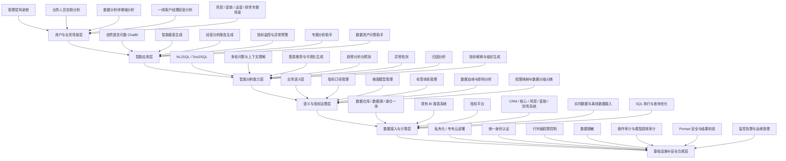

# 银行业智能数据分析平台功能框架

## 1. 客户背景

当前客户属于银行行业。传统商务智能（BI）系统存在技术门槛高、分析响应周期长、业务人员依赖数据分析师、管理层难以及时获得经营洞察等问题。

客户希望引入新一代智能数据分析平台，通过自然语言交互、智能问数、自动化分析和智能报告生成能力，降低数据使用门槛，提升业务决策敏捷度。

目前客户仍处于调研阶段，预算会基于调研结果动态规划。因此，本阶段材料应重点说明产品能力边界、建设路径、部署要求和可分期落地范围。

## 2. 产品定位

本产品定位为面向银行场景的智能数据分析平台，不只是单点 ChatBI 工具，而是覆盖数据接入、语义治理、自然语言问数、智能分析、报告生成、安全合规和运维审计的一体化平台。

系统名称当前可暂定为“银行智能数据分析平台”或“ChatBI 智能问数平台”。现阶段客户尚未指定正式产品名称，后续可根据客户品牌、内部系统命名规范或招投标材料要求进行调整。

核心价值包括：

- 面向管理层：快速查看经营指标、异常预警和决策洞察。
- 面向业务人员：通过自然语言自助问数，减少对数据团队的依赖。
- 面向数据分析师：提升取数、分析、归因和报告生成效率。
- 面向一线人员：支持客户经营、营销转化、风险识别等业务场景分析。
- 面向 IT 和数据治理团队：统一指标口径、权限控制、审计追溯和安全合规。

## 3. 核心概念说明

### 3.1 智能问数是什么

智能问数是指用户不需要手动写 SQL，也不需要反复找数据分析师取数，而是直接用自然语言向系统提问，由系统自动理解业务意图、识别指标口径、生成查询语句、返回数据结果，并进一步生成图表和分析结论。

示例问题：

- “本月各分行存款余额排名是多少？”
- “最近三个月个人贷款新增趋势怎么样？”
- “哪些客户经理的 AUM 增长较快？”
- “本周信用卡营销转化率下降的原因是什么？”
- “帮我生成一份本月经营分析报告。”

智能问数不是简单聊天机器人，而是自然语言驱动的数据分析入口。它背后需要连接数据仓库、指标体系、权限系统、语义层、SQL 执行引擎和大模型能力。

### 3.2 智能仪表盘是什么

智能仪表盘是在传统 BI 仪表盘基础上增加自然语言交互、自动分析、智能解释和动态生成能力。

传统仪表盘通常是固定页面，用户只能查看预先配置好的指标和图表。智能仪表盘则可以根据用户问题、角色权限和业务场景，自动生成或调整展示内容，并对指标变化给出解释。

典型能力包括：

- 自动展示关键经营指标。
- 支持自然语言追问和筛选。
- 自动生成趋势图、对比图、排名图和结构分析图。
- 对异常指标进行提示和解释。
- 支持从总览指标下钻到机构、产品、客户、渠道等维度。
- 根据分析结果生成经营建议或报告摘要。

### 3.3 目标用户与使用场景

该平台的使用对象不局限于数据团队，而是覆盖银行内部多个角色。

| 用户对象 | 典型使用场景 |
|---|---|
| 个人客户经理 | 分析客户资产变化、客户分层、产品持有情况、营销机会和业绩目标完成情况 |
| 对公客户经理 | 分析企业客户收入、贷款、存款、授信、交易流水和经营贡献 |
| 支行 / 分行管理层 | 查看机构经营指标、收入结构、客户结构、产品销售情况和异常波动 |
| 总行管理层 | 查看全行经营概览、区域表现、业务结构、风险趋势和战略指标 |
| 数据分析师 | 快速取数、验证指标口径、生成专题分析和报告初稿 |
| 风控 / 营销 / 运营 / 财务人员 | 围绕条线业务进行专题分析、监控预警和经营复盘 |

## 4. 客户当前要求

客户当前关注的不是单一功能点，而是一个具备数据准备、智能问数、自动分析和报告生成能力的自助分析平台。

当前要求可以归纳为：

- 具备数据准备能力，能够接入并整理银行已有数据源。
- 具备智能问数能力，支持 ChatBI 自然语言查询。
- 能够根据自然语言生成数据洞察报告。
- 能够根据自然语言生成或完善经营仪表盘。
- 能够补齐传统商务智能平台缺少的自动分析能力。
- 能够服务管理层、业务人员、数据分析师和一线人员。
- 后续具备本地化部署、安全合规、权限控制和审计追溯能力。

## 5. 功能框架图

## 6. 功能模块说明

### 6.1 用户与业务场景层

该层面向不同类型的银行用户，承载具体业务场景。

| 用户角色 | 典型需求 |
|---|---|
| 管理层 | 查看经营指标、趋势变化、异常预警、经营分析结论 |
| 业务人员 | 用自然语言查询指标、生成图表、完成日常经营分析 |
| 数据分析师 | 快速取数、验证口径、生成分析结论和专题报告 |
| 一线客户经理 | 分析客户经营、营销机会、风险线索和业绩目标 |
| IT / 数据治理团队 | 管理指标口径、数据权限、审计日志和系统集成 |

### 6.2 智能应用层

该层是用户直接使用的产品能力。

- 自然语言问数 ChatBI：支持通过自然语言查询业务指标、明细数据和分析结果。
- 智能报表生成：根据用户问题或固定模板自动生成图表和报表。
- 经营分析报告生成：自动生成日报、周报、月报、专题经营分析报告。
- 指标监控与异常预警：对关键指标进行监控，发现异常后推送预警和解释。
- 专题分析助手：围绕营销、风控、运营、财务等主题提供场景化分析能力。
- 数据资产问答助手：支持查询表、字段、指标、口径、血缘和使用说明。

### 6.3 智能分析能力层

该层提供平台的核心智能能力。

- NL2SQL / Text2SQL：将自然语言问题转换为可执行 SQL。
- 多轮问答：支持追问、条件补充、上下文继承和结果解释。
- 图表推荐：根据指标类型、维度结构和用户意图推荐合适图表。
- 趋势分析：识别指标变化趋势，支持同比、环比和时间序列分析。
- 异常检测：发现指标突增、突降、波动异常和结构异常。
- 归因分析：定位指标变化原因，支持维度下钻和贡献度分析。
- 结论生成：根据数据结果自动生成业务化分析结论。

### 6.4 语义与指标治理层

该层决定 ChatBI 是否能在银行真实业务中稳定可用。

- 业务语义层：把数据库表字段转换成业务人员能理解的术语。
- 指标口径管理：统一存款余额、贷款余额、不良率、AUM 等指标定义。
- 维度模型管理：维护机构、客户、产品、时间、渠道等分析维度。
- 标签体系管理：管理客户标签、产品标签、风险标签和营销标签。
- 数据血缘与影响分析：追踪指标、字段、报表和数据表之间的依赖关系。
- 权限映射：将用户角色、组织机构、数据权限和指标权限进行绑定。

### 6.5 数据接入与计算层

该层负责接入客户已有数据资产。

- 数据仓库、数据湖、湖仓一体平台。
- Oracle、MySQL、PostgreSQL、Hive、ClickHouse、Greenplum 等数据库。
- 现有 BI 系统、报表系统和指标平台。
- CRM、核心业务系统、风控系统、营销系统、财务系统。
- 离线数据、实时数据、接口数据和文件数据。
- SQL 执行、查询优化、缓存和任务调度。

### 6.6 基础设施与安全合规层

银行客户通常优先关注本地部署、数据安全和审计追溯。

- 私有化或专有云部署，保证数据不出安全边界。
- 统一身份认证，对接 LDAP、AD、SSO 或统一门户。
- 细粒度权限控制，支持库、表、字段、指标、行列级权限。
- 数据脱敏，支持敏感字段识别、展示脱敏和导出脱敏。
- 操作审计，记录用户查询、SQL 执行、数据导出和权限变更。
- 模型调用审计，记录 Prompt、模型响应、调用链路和结果反馈。
- Prompt 安全与结果校验，降低越权访问、幻觉和错误 SQL 风险。
- 监控告警，覆盖服务状态、模型调用、任务运行和资源使用情况。

## 7. 本地部署要求

本地部署不仅是将应用安装到客户服务器，还需要准备模型推理环境、数据源访问、语义层配置、安全合规、日志审计和运维监控。

### 7.1 基础环境

- Linux 服务器。
- Docker 或 Kubernetes 环境。
- 内网镜像仓库。
- 内网域名或访问地址。
- SSL 证书。
- 数据库、中间件和对象存储资源。
- 日志采集、监控告警和备份恢复环境。

### 7.2 服务器资源

| 资源类型 | 主要用途 |
|---|---|
| 应用服务器 | 部署前端、后端、网关、权限服务、任务调度 |
| 模型推理服务器 | 部署大模型、Embedding 模型、Rerank 模型、NL2SQL 相关服务 |
| 元数据库服务器 | 存储用户、权限、配置、语义层、指标、审计日志 |
| 向量数据库服务器 | 存储知识库、指标说明、字段说明、文档向量 |
| 缓存 / 消息队列 | 支撑高并发查询、异步任务、报告生成和通知推送 |

### 7.3 模型能力

可根据客户安全要求选择私有化大模型或专有云模型。

需要的模型能力包括：

- 问答与推理模型。
- NL2SQL / Text2SQL 能力。
- 报告生成能力。
- Embedding 模型。
- Rerank 模型。
- 模型网关、调用审计和限流控制。

### 7.4 客户需提供材料

- 数据源清单。
- 数据库连接方式和访问白名单。
- 表结构、字段说明和样例数据。
- 指标口径文档。
- 组织架构和权限矩阵。
- 典型业务问题清单。
- 现有报表样例。
- 目标用户角色和使用场景。
- 安全合规和审计要求。

## 8. 分阶段建设路线

客户当前处于调研阶段，建议采用分阶段建设方式，便于预算规划和试点验证。

### 第一阶段：ChatBI MVP

目标是验证自然语言问数的可用性。

建设内容：

- 选择 2 到 3 个高频业务场景。
- 接入核心数据源和关键指标。
- 建设基础语义层。
- 支持自然语言问数、SQL 生成、图表生成和结果解释。
- 接入基础权限控制和操作日志。

### 第二阶段：智能分析增强

目标是从“查数”升级为“分析”。

建设内容：

- 多轮追问和上下文理解。
- 同比、环比、趋势分析。
- 异常检测和波动解释。
- 维度下钻和归因分析。
- 经营分析报告自动生成。

### 第三阶段：场景化智能助手

目标是面向具体业务条线提供专题能力。

建设内容：

- 管理层经营分析助手。
- 营销分析助手。
- 风控分析助手。
- 运营分析助手。
- 客户经理经营助手。
- 指标监控与预警闭环。

### 第四阶段：企业级数据智能平台

目标是形成可长期运营的企业级平台。

建设内容：

- 完善企业级语义层和指标体系。
- 深度对接数据治理、权限、审计和统一门户。
- 建设模型治理、Prompt 安全和结果校验机制。
- 支持跨系统数据资产问答和数据血缘分析。
- 建立持续运营、评估、反馈和优化机制。

## 9. 与甘特图的区别

功能框架图用于说明产品由哪些能力模块组成，以及模块之间的层级关系。

甘特图用于说明项目什么时候做、做多久、谁负责、依赖关系是什么。

客户当前要求的“产品功能框架图”不是甘特图。若后续进入预算和实施排期阶段，可在本框架基础上继续补充分阶段建设路线图或项目甘特图。

## 10. 建议对外表达

可以向客户说明：

> 本方案不是单一 ChatBI 问数工具，而是面向银行业务场景建设的智能数据分析平台。平台以自然语言问数为入口，以语义层和指标治理为基础，结合智能分析、报告生成、安全合规和本地化部署能力，帮助管理层、业务人员、分析师和一线人员降低数据使用门槛，提升经营分析和决策效率。
