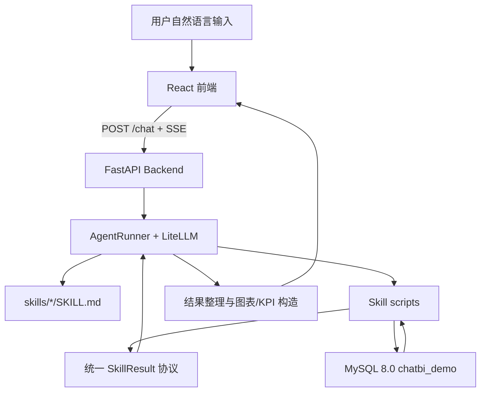

# 系统架构

## 分层结构

## 模块说明
- `frontend/`：React 对话界面，负责输入、SSE 接收、消息分发、图表和 KPI 渲染。
- `backend/main.py`：FastAPI 入口，提供 `POST /chat` SSE 接口。
- `backend/agent/prompt_builder.py`：读取 `skills/*/SKILL.md`，生成包含 Skill 描述和安全边界的 System Prompt。
- `backend/agent/planner.py`：调用 LiteLLM，生成 Skill 执行计划。
- `backend/agent/executor.py`：定位 Skill 脚本，执行脚本并归一化 SkillResult。
- `backend/agent/formatter.py`：将 SkillResult 转换为 SSE 消息。
- `backend/agent/runner.py`：串联 plan → execute → format 流程。
- `backend/renderers/`：将结构化结果转换为 ECharts option 和 KPI 卡片数据。
- `skills/`：Agent Skill 目录，每个 Skill 由 `SKILL.md` 和可选 `scripts/` 组成。
- `database/`：MySQL 表结构、业务数据和语义层元数据初始化。

## 模块边界
- `main.py` 只负责 HTTP/SSE 协议层和路由注册。
- `config.py` 只负责环境变量读取和默认配置。
- `prompt_builder.py` 只负责读取 Skill 文档并构造 Prompt，不执行脚本。
- `planner.py` 负责 Agent 计划生成，不执行脚本。
- `executor.py` 负责 Skill 定位、脚本调度和 SkillResult 归一化。
- `formatter.py` 负责将 SkillResult 转换为 SSE 消息。
- `runner.py` 只负责 Agent 主循环编排。
- `renderers/` 负责把结构化结果转换为前端消息，不查询数据库。

## Skill 边界
- `SKILL.md` 描述触发条件、工作流、命令示例和安全边界。
- `scripts/` 放确定性执行入口，可以访问 MySQL，但不得依赖前端或 FastAPI 路由。
- `scripts/` 的 `--json` 输出必须遵循统一 SkillResult 协议：`kind`、`text`、`data`、`charts`、`kpis`。
- `skills/_shared/` 放脚本共享的数据库、SQL 和输出协议工具。
- 问数和决策建议 Skill 只执行 `SELECT`。
- 别名管理 Skill 只向 `alias_mapping` 插入已验证别名。

## 依赖方向
- 前端依赖方向：`types/` → `hooks/` → `components/` → `App.tsx`。
- 后端依赖方向：`config.py` → `agent/prompt_builder.py` → `agent/planner.py` / `agent/executor.py` / `agent/formatter.py` → `agent/runner.py` → `main.py`。
- Skill 脚本可以依赖标准库和 `skills/_shared/`，但不得反向依赖 FastAPI 路由或前端。
- 文档规则中的通用依赖方向为：`types/` → `lib/utils/` → `services/` → `app/`。当前仓库未完全落地这些目录时，应按同等层级含义执行。

## 禁止跨界
- 前端组件禁止直接执行 SQL 或了解 Skill 脚本细节。
- Agent 禁止绕过 Skill 文档直接编造数据库操作。
- 渲染模块禁止修改数据库。
- LLM 禁止替代确定性脚本计算指标事实。

## 关键技术决策
- 使用 `SKILL.md + scripts/` 管理业务能力：Agent 负责选择能力，确定性脚本负责查询、别名写入和规则建议。
- Skill 脚本的 `--json` 输出统一为 SkillResult：`kind`、`text`、`data`、`charts`、`kpis`。
- 使用 MySQL 语义层元数据约束问数：指标、维度和别名来自治理表，降低模型自由生成 SQL 的风险。
- 使用 SSE 输出过程消息：前端可以实时展示 thinking、文本、图表、KPI 和错误，满足可解释性要求。

## 当前架构债务
- `chatbi_semantic_query.py` 和 `generate_decision_advice.py` 仍超过 300 行，需要继续拆分为 parser、rules、render、SQL builder 等子模块。
- 决策建议已能输出 KPI，但建议明细仍主要依赖文本展示，后续可升级为结构化建议卡片。
