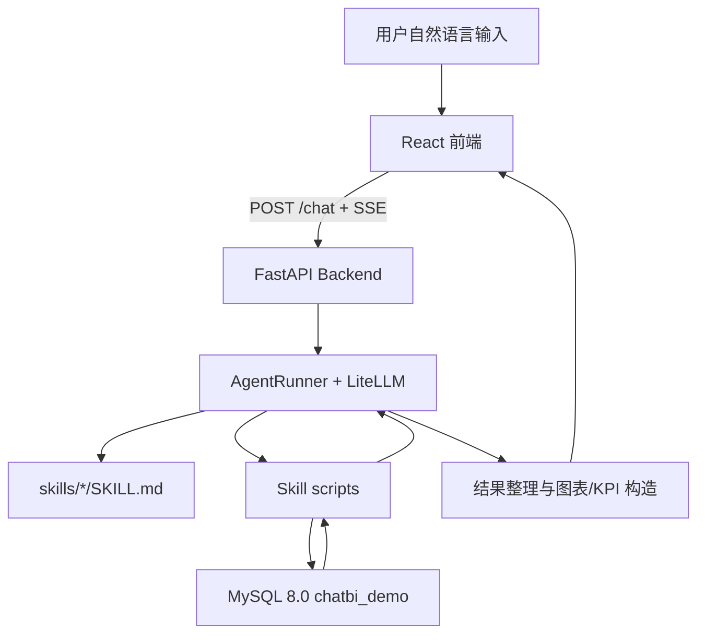

# 系统架构

## 分层结构

## 模块说明
- `frontend/`：React 对话界面，负责输入、SSE 接收、消息分发、图表和 KPI 渲染。
- `backend/main.py`：FastAPI 入口，提供 `POST /chat` SSE 接口。
- `backend/agent/prompt_builder.py`：读取 `skills/*/SKILL.md`，生成包含 Skill 描述和安全边界的 System Prompt。
- `backend/agent/runner.py`：调用 LiteLLM，选择 Skill，调度脚本，整理结果并输出消息。
- `backend/renderers/`：将脚本 JSON 结果转换为 ECharts option 和 KPI 卡片数据。
- `skills/`：Agent Skill 目录，每个 Skill 由 `SKILL.md` 和可选 `scripts/` 组成。
- `init_db/`：MySQL 表结构、业务数据和语义层元数据初始化。

## 依赖方向
前端依赖方向：`types/` → `hooks/` → `components/` → `App.tsx`。

后端依赖方向：`config.py` → `agent/prompt_builder.py` → `agent/runner.py` → `main.py`。Skill 脚本可以依赖标准库和本地 `mysql` CLI，但不得反向依赖 FastAPI 路由。

文档规则中的通用依赖方向为：`types/` → `lib/utils/` → `services/` → `app/`。当前仓库未完全落地这些目录时，应按同等层级含义执行，不得让上层 UI 或路由反向污染底层类型、工具和服务。

## 关键技术决策
- 使用 `SKILL.md + scripts/` 管理业务能力：让 Agent 负责选择能力，确定性脚本负责查询、别名写入和规则建议。
- 使用 MySQL 语义层元数据约束问数：指标、维度和别名来自治理表，降低模型自由生成 SQL 的风险。
- 使用 SSE 输出过程消息：前端可以实时展示 thinking、文本、图表、KPI 和错误，满足可解释性要求。
