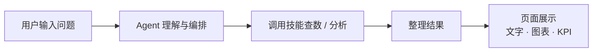
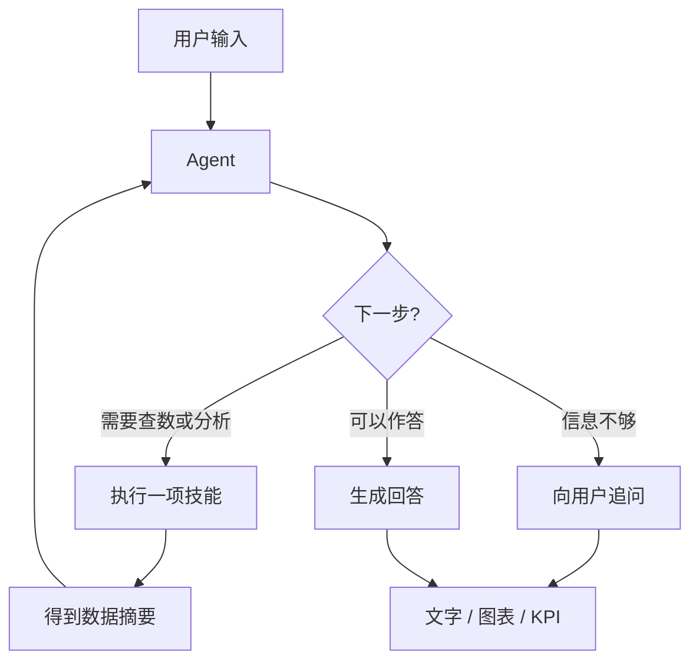
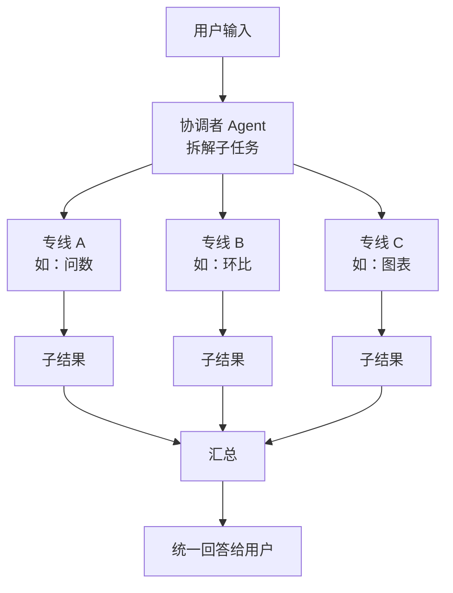
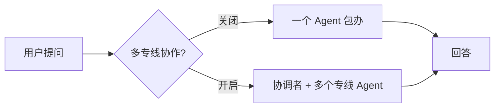
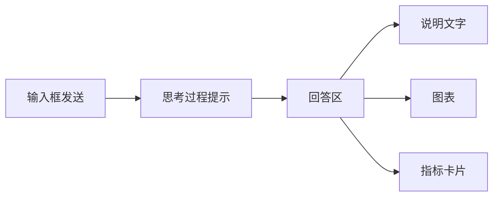

# ChatBI 运作流程（简图）

从用户提问到页面展示结果的抽象流程。界面说明见 [user-guide.md](user-guide.md)。

---

## 1. 整体：一问一答

---

## 2. 单 Agent 模式（默认）

一个 Agent 反复「想 → 做 → 看结果」，直到能回答用户。

**三种决策（对用户而言）**

| 决策 | 含义 |
|------|------|
| 执行技能 | 去数据库或文件里取数、算指标、出图等 |
| 追问 | 问题不清楚，先问用户补全条件 |
| 完成 | 用已有结果组织成最终回答 |

---

## 3. 多专线模式（开启「多专线协作」）

先由 **协调者** 拆成几个子任务，再交给 **不同专线的 Agent** 分别处理，最后 **汇总** 成一条回答。

每个专线 Agent 内部仍是：**想 → 执行技能 → 看结果 → 完成或追问**（与单 Agent 相同，只是擅长的任务不同）。

---

## 4. 两种模式怎么选

| | 单 Agent | 多专线 |
|--|----------|--------|
| 适合 | 简单问数、单一步骤 | 既要查数又要环比、图表等多步组合 |
| 感受 | 一条线做完 | 分头做再合成一篇回答 |

---

## 5. 用户侧能看到什么

过程中可随时 **中止**；需要登录时须先登录（开发环境可能默认免登录）。
