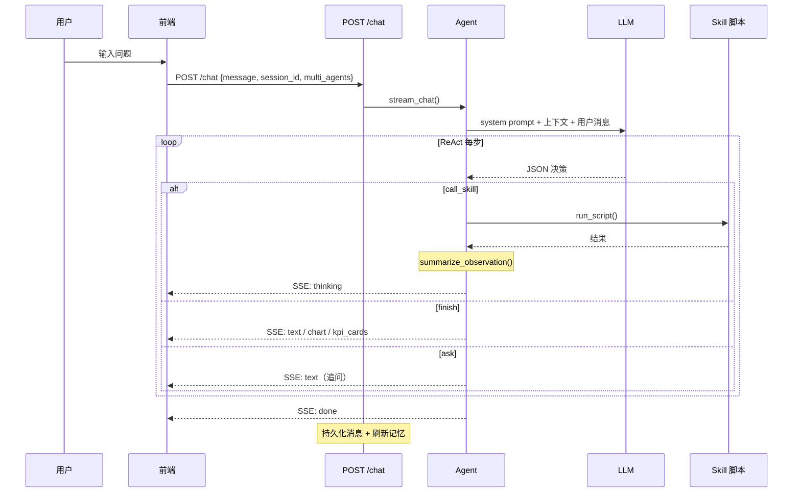

# ChatBI Agent 提示词组成与上下文架构

> 解释每一次用户查询时，Agent 收到的完整 prompt 由哪些部分组成，含 system prompt 分层、上下文窗口管理、摘要机制、技能描述注入等。

---

## 1. 总体架构

ChatBI 支持两种 Agent 模式，prompt 组成逻辑相似但各有特化：

| 模式 | 引擎 | 说明 |
|---|---|---|
| **单 Agent**（默认） | `react_runner.py` — `stream_chat_react()` | 一个 Agent 反复「思考→执行技能→看结果」直到可以作答 |
| **多专线**（开启协作） | `multi_agent_runner.py` — `stream_chat_multi_agent()` | Manager 拆解子任务 → 多个专线 Agent 分别执行 → 汇总 |

两种模式最终都调用 LLM，发送的消息列表结构为：

```
[
  {"role": "system", "content": <最终系统提示词>},
  ...<对话历史 + ReAct Observation 轮次>,
  {"role": "user", "content": "请只输出一个 JSON 对象作为本步决策..."}
]
```

---

## 2. System Prompt 的五层叠加

### 完整组装顺序（从上到下，后面的追加在前面之上）

```
┌─────────────────────────────────────────────────────────┐
│  第 5 层: 滑动窗口上下文（对话历史/会话摘要）            │
│  ─────────────────────────────────────────────────────  │
│  第 4 层: 本轮数据源判断（演示库 / 上传文件 / 待判断）    │
│  ─────────────────────────────────────────────────────  │
│  第 3 层: 可用技能列表（markdown 格式的 Skill 描述）      │
│  ─────────────────────────────────────────────────────  │
│  第 2 层: 基础指令（AGENT_REACT_INSTRUCTION）             │
│  ─────────────────────────────────────────────────────  │
│  第 1 层: 角色提示词（多专线模式）/ 记忆块                │
│          （可选，以 `\n\n` 拼在基础指令之前）              │
└─────────────────────────────────────────────────────────┘
```

---

### 第 1 层：记忆块 + 角色提示词（可选，前置层）

**来源**：`memory_service.py` → `format_memory_for_prompt()` + `multi_agent_registry.py` → `agent_role_prompt()`

**组装方式** — 如果同时存在，**记忆块在最前**，角色提示词紧随其后：

```python
if memory_block and memory_block.strip():
    system_prompt = memory_block.strip() + "\n\n" + system_prompt  # 最外层
if role_prompt and role_prompt.strip():
    system_prompt = role_prompt.strip() + "\n\n" + system_prompt    # 次外层
```

**记忆块内容**（`format_memory_for_prompt`）：

```
## 长期偏好与习惯
<用户长期记忆，最多 2000 字，记录分析口径偏好>

## 近期会话摘要
- **会话标题A**：摘要内容...（最多 500 字）
- **会话标题B**：摘要内容...

（以上为用户侧记忆，仅作风格与意图参考，业务数据以工具查询结果为准。）
```

- 长期记忆来自 DB `long_term_memory` 表，由 `refresh_memory_after_turn()` 每次对话后异步更新
- 会话摘要来自 DB `session_summaries` 表，最多取最近 5 条
- 可用环境变量 `CHATBI_MEMORY_DISABLED=1` 关闭记忆

**角色提示词内容**（仅多专线模式）：

```
你是【上传与文件分析】专线：只处理用户本地上传的 CSV/XLSX ...
```

来自 `skills/_agents/registry.yaml` 中每个专线的 `role_prompt` 字段。

---

### 第 2 层：基础指令（AGENT_REACT_INSTRUCTION）

**来源**：`prompt_builder.py` 第 193-251 行

**内容结构**（约 1300 字中文）：

```
你是一个 ChatBI 数据分析助手，帮助用户用自然语言查询业务数据、管理语义别名、生成经营决策建议。

## 用户上传的数据文件（优先于演示库查询）
- 上传文件路径规则...
- 数据源判断覆盖规则...
- 文件重复调用防护...

## ReAct 工作方式
系统在对话中循环：你输出 JSON 决策 → 可能执行 Skill → 将 Observation 摘要追加到对话 → 你再输出下一步 JSON...

## 自然语言触发规则
- 问业务数据 → chatbi-semantic-query
- 问表清单 → chatbi-database-overview
- 短句也必须触发查询...
- 演示数据默认年份是 2026...

## 每一步 JSON 字段
- action: call_skill / finish / ask
- thought: 思考
- skill / skill_args: 调用技能时必填
- text / chart_plan / kpi_cards: finish 时必填

## 可视化规则
- 分类对比 → bar；时间趋势 → line；占比 → pie

## 约束
- 以完成用户意图为目标，禁止编造数据
- 每轮最多一次 call_skill
- 只从可用 Skill 中选择
```

最后以 `SKILL_SELECTION_HINT` 结尾：

```
在输出 `call_skill` 前，请对照各 Skill 下的「选用时机」「不要用」「必备上下文」；
若与当前对话或 Observation 不符，改选其它技能或输出 `ask`/`finish`。
```

---

### 第 3 层：可用技能列表

**来源**：`prompt_builder.py` → `_skills_markdown_lines()`

对每个 SkillDoc 生成：

```
### chatbi-semantic-query
描述：Use when Codex or another agent needs to answer Chinese natural-language data questions...
**选用时机**：
- 用户用中文问演示库业务指标、排行、趋势...
**不要用**：
- 对话含本地上传路径...
**必备上下文**：
- 演示库可连接...
\`\`\`
Workflow
1. 解析用户问题为 SQL...
2. 执行查询...
Supported Semantics
- 汇总/对比/排行/趋势...
Visualization Guidance
- 结果含分类字段 → 柱状图...
\`\`\`
```

- 技能来自扫描 `skills/*/SKILL.md`，过滤掉 `skill_registry_repo.disabled_slugs()` 中禁用的
- 从 SKILL.md 中只提取以下章节内容：Workflow、Commands、Safety、Visualization Guidance、Supported Semantics、Presentation Guidance（及其中文对应）
- 多专线模式下，每个专线只看到自己被分配的技能列表

---

### 第 4 层：本轮数据源判断

**来源**：`data_source_intent.py` → `format_intent_context_block()`

根据用户本轮消息的语义分析，注入一个上下文块：

#### 当判断为演示库问数时：

```
## 本轮数据源判断（系统解析，选技能时必须对齐）
- **本轮目标：演示业务库问数**（`chatbi-semantic-query` 等演示库技能）。即使用户曾在会话中上传过文件，本轮也不要用 `chatbi-file-ingestion` 代替数据库查询。
```

#### 当判断为上传文件分析时：

```
## 本轮数据源判断（系统解析，选技能时必须对齐）
- **本轮目标：用户上传文件或其延续分析**（`chatbi-file-ingestion` / `chatbi-auto-analysis`）。不要用 `chatbi-semantic-query` 查询演示库来代替文件内容。
- 关联上传路径：`/tmp/chatbi-uploads/xxx.csv`
```

#### 当无法判断时：

```
## 本轮数据源判断（系统解析，选技能时必须对齐）
- **本轮数据源待你结合上下文判断**：若用户仍在说上传表/附件/采纳/画图，走上传技能；若用户在问区域/销售额/趋势等业务库指标且未指向文件，走演示库 `chatbi-semantic-query`。
```

**决策逻辑**（`resolve_data_source`）按优先级：
1. 用户消息含 `不考虑上传`、`查数据库` 等显式标记 → DEMO_DATABASE
2. 消息含上传路径或 `csv`、`上传`、`采纳` 等延续信号 → UPLOAD_FILE
3. 消息含 `销售`、`毛利`、`环比` 等业务词 → DEMO_DATABASE
4. 会话历史曾出现上传路径 → AMBIGUOUS（交 LLM 判断）
5. 以上都不匹配 → DEMO_DATABASE（默认）

---

### 第 5 层：滑动窗口上下文（对话历史 + 会话摘要）

**来源**：`context_window.py` → `build_react_context()` → `ConversationContextBuilder`

这块追加在 system prompt 最末尾：

```
## 会话摘要
<来自 session_summaries 表的最近摘要，最多 2000 字>

## 对话历史
user: 上轮用户消息...（截断 500 字）
assistant: 上轮助手回复...（截断 500 字）
user: 上上轮用户消息...
assistant: 上上轮助手回复...
```

**关键参数**：
- `max_recent_turns` = 10（保留最近 10 轮对话）
- 每条消息截断为 **500 字符**
- 会话摘要截断为 **2000 字符**
- 超出最近 20 条的历史通过**关键词检索**召回：提取查询中的关键词 + 预定义的技能关键词列表（"skill"、"指标"、"查询"、"数据库"等），匹配至少 2 个关键词的段落被召回，最多 5 段，合计最多 1500 字符

---

## 3. 不同模式的 prompt 差异

### 3.1 单 Agent ReAct 模式

system prompt = `第 1 层(可选) + 第 2 层 + 第 3 层 + 第 4 层 + 第 5 层`

LLM 消息：
```
system: [五层叠加的最终 system prompt]
user: 上轮用户消息
assistant: 上轮助手回复
user: 用户最新消息
user: 请只输出一个 JSON 对象作为本步决策...
```

### 3.2 子任务专线 ReAct 模式（多专线）

用 `prompt_subagent.py` 中的 `AGENT_REACT_SUBAGENT_HEADER` **替换**基础指令：

```
你是 ChatBI 的一条「子任务专线」ReAct 代理：完成 Manager 交办片段...

## 能力边界
- 只可使用下方「可用 Skill」中的技能名称
- 若交办超出你的技能：输出 action=finish
- 禁止调用未在可用列表中的技能
...

## 上传与文件（仅当本专线有相关技能时才出现）
...

## 每一步 JSON 字段
...（同单 Agent 的 JSON 格式，但面向子任务交付）

## 环比重试规则（仅当有 chatbi-comparison 技能时才出现）
...

## 预览行规则（根据可用技能动态生成）
...
```

**消息替换**：`multi_agent_messages.py` 将最新一条 user 消息替换为：

```
【本轮数据源】演示业务库（查演示库，勿用历史上传文件代替）

【Manager 交办】
查询 2026 年 1-4 月各区域销售额排行

【前置子任务结果摘要】
（可选，如果存在依赖）
{"skill": "chatbi-semantic-query", "rows": [...], ...}

【用户原述】
2026年1-4月各区域销售额排行
```

### 3.3 Manager 规划模式

用 `multi_agent_manager.py` 中的专用 system prompt：

```
你是 ChatBI 多专线的 **Manager**（第 1 轮规划）：根据用户对话，
将需求拆解为 1～4 个子任务，并指派给下方专线之一执行。

## 专线与能力
- demo_query（演示问数）拥有：chatbi-semantic-query, ...
- upload_analyst（上传与文件分析）拥有：chatbi-file-ingestion, ...
- period_compare（环比对比）拥有：chatbi-comparison, ...
- viz_board（出图/看板）拥有：chatbi-chart-recommendation, ...

## 路由硬约束
- upload_analyst：用户本地上传文件...必须派此专线
- demo_query：仅用于对演示业务库的问数...

## 技能缺失处理
...

## 输出 JSON
{ "tasks": [{"agent_id": "...", "handoff_instruction": "...", "depends_on": null}], ... }
```

LLM 消息：
```
system: [Manager 专用 system prompt, 含能力表 + 路由规则]
...对话尾（最多 12 轮）...
user: （用户最新消息 + 进度摘要 digest + 上下文提示）
```

### 3.4 最终汇总模式（多专线之后）

用 `multi_agent_summarize.py` 中的专用 system prompt：

```
你是 ChatBI 多专线的 **Manager**：综合各子任务专线返回的 Observation 摘要，
向用户输出一份连贯、可执行的 Markdown 最终答复。

规则：
- 仅基于各子任务的「交办说明」与 Observation、以及用户问题组织语言
- 禁止编造未出现的数字
- 同一专线的 observation 可能含多段工具摘要，须全部纳入

输出 JSON：
{ "text": "...", "chart_plan": null, "kpi_cards": [] }
```

LLM 消息：
```
system: [汇总专用 system prompt]
user: {
  "user_question": "...",
  "specialists": [
    {"agent": "demo_query", "observation": "...", "round": 1},
    {"agent": "period_compare", "observation": "...", "round": 1},
    ...
  ]
}
```

---

## 4. 上下文窗口与摘要机制

### 4.1 滑动窗口

```
全部消息（来自 DB）
├── 超出最近 20 条的历史 ──→ 关键词检索 ──→ 最多 5 段 × 300 字 → 合并 ≤1500 字
│                              ↑
└── 最近 20 条（10 轮） ──→ 保留，每条截断 500 字
```

### 4.2 Observation 摘要

每次技能执行后，结果通过 `summarize_observation()` 压缩为紧凑 JSON：

```json
{
  "skill": "chatbi-semantic-query",
  "ok": true,
  "kind": "data",
  "row_count": 25,
  "columns": ["region", "sales_amount"],
  "sample_rows": [
    {"region": "华东", "sales_amount": 12345}
  ]
}
```

- `text` 字段截断为 **800 字符**
- 完整 rows 替换为 `row_count` + `columns` + `sample_rows`（前 5 行）
- `chatbi-comparison` 保留 `comparison_period` 元数据
- 空结果时自动检查 WHERE 子句矛盾

摘要通过 `OBS_HEADER` 前缀注入：

```
以下为工具执行后的 Observation（JSON 摘要），请基于事实继续推理：
{"skill": "chatbi-semantic-query", "row_count": 25, ...}
```

### 4.3 执行后记忆刷新

每轮对话完成后 `refresh_memory_after_turn()`：

1. 调用 LLM 生成 ≤400 字的会话摘要
2. 存入 `session_summaries` 表（每用户最多 30 条）
3. 合并最近 15 条摘要与旧长期记忆
4. 生成 ≤1200 字的「用户查询习惯与稳定偏好」存入 `long_term_memory`

### 4.4 其他截断限制

| 场景 | 限制 | 来源 |
|---|---|---|
| ReAct 最大步数 | 8 | `config.py` agent_max_steps |
| Manager 最大轮次 | 5 | `registry.yaml` max_manager_rounds |
| 每批最大子任务 | 4 | `registry.yaml` max_agents_per_round |
| 每条消息截断 | 500 字符 | `context_window.py` |
| 会话摘要截断 | 2000 字符 | `context_window.py` |
| 历史检索截断 | 1500 字符 | `context_window.py` |
| Manager 对话尾 | 12 轮 | `multi_agent_manager.py` |
| 上下文扫描窗口 | 28 轮 | `multi_agent_manager.py` |

---

## 5. 完整请求示例（单 Agent ReAct 模式）

以下展示一次典型查询 `"2026年1-4月各区域销售额排行"` 的完整 prompt 结构：

```
=== system prompt（五层叠加后） ===

[第 1 层 - 记忆块]
## 长期偏好与习惯
用户偏好按区域维度查看销售数据，通常关注华东、华南区域...

## 近期会话摘要
- **2026年1月销售额分析**：用户查询了1月销售额排行，展示了柱状图...

（以上为用户侧记忆，仅作风格与意图参考，业务数据以工具查询结果为准。）

---

[第 1 层 - 角色提示词]  ← 仅多专线模式有
你是【演示问数】专线：负责对演示业务库的中文自然语言问数...

---

[第 2 层 - 基础指令]
你是一个 ChatBI 数据分析助手...

## 用户上传的数据文件
...

## ReAct 工作方式
...

## 自然语言触发规则
...

## 每一步 JSON 字段
...

## 可视化规则
...

## 约束
...

在输出 `call_skill` 前，请对照各 Skill 下的「选用时机」「不要用」「必备上下文」...

---

[第 3 层 - 可用技能列表]
### chatbi-semantic-query
描述：...
**选用时机**：...
**不要用**：...
**必备上下文**：...
```
Workflow
...

### chatbi-database-overview
描述：...
...

### chatbi-comparison
...

---

[第 4 层 - 数据源判断]
## 本轮数据源判断（系统解析，选技能时必须对齐）
- **本轮目标：演示业务库问数**（`chatbi-semantic-query` 等演示库技能）。
  即使用户曾在会话中上传过文件，本轮也不要用 `chatbi-file-ingestion` 代替数据库查询。

---

[第 5 层 - 滑动窗口上下文]
## 会话摘要
用户之前查询了各区域1月销售额...

## 对话历史
user: 今年1月各区域销售额情况
assistant: | 区域 | 销售额 |...
user: 顺便看看毛利率
assistant: | 区域 | 毛利率 |...

=== messages（消息轮次） ===

user: 2026年1-4月各区域销售额排行
assistant: {"action": "call_skill", "skill": "chatbi-semantic-query", ...}
user: 以下为工具执行后的 Observation（JSON 摘要），请基于事实继续推理：
       {"skill": "chatbi-semantic-query", "row_count": 25, ...}
assistant: {"action": "finish", "text": "| 区域 | 销售额 |...", "chart_plan": {...}, "kpi_cards": [...]}

=== 最终提示 ===

user: 请只输出一个 JSON 对象作为本步决策（必须包含 action 字段），不要输出其它文字。
```

---

## 6. 完整请求示例（多专线模式）

```
=== Manager 第 1 轮 ===

system: [Manager 第 1 轮 system prompt，含专线能力表 + 路由约束]
messages: [...历史对话尾 12 轮...]
user: 用户消息 + 上下文提示（数据源）+ 进度摘要（首轮为空）

→ Manager 返回 JSON：
  {
    "tasks": [
      {"agent_id": "demo_query", "handoff_instruction": "查询1-4月各区域销售额排行", "depends_on": null},
      {"agent_id": "period_compare", "handoff_instruction": "计算月度环比", "depends_on": [0]}
    ],
    "finalize_after_this_batch": false
  }

=== 子任务专线 demo_query ===

system: [子任务 ReAct system prompt，仅含 demo_query 可用的技能]
messages: [...历史对话...]
user: 【本轮数据源】演示业务库
       【Manager 交办】查询1-4月各区域销售额排行
       【用户原述】2026年1-4月各区域销售额排行

→ demo_query 返回: {"action": "call_skill", ...} → Observation → {"action": "finish", "text": "..."}

=== 子任务专线 period_compare（依赖 demo_query 输出） ===

system: [子任务 ReAct system prompt，仅含 period_compare 可用的技能]
messages: [...历史对话...]
user: 【本轮数据源】演示业务库
       【Manager 交办】基于上一步的销售额排行，计算月度环比
       【前置子任务结果摘要】{"row_count": 25, "columns": [...], ...}
       【用户原述】2026年1-4月各区域销售额排行

→ period_compare 返回: ...

=== ...（可能多轮 Manager）... ===

=== 最终汇总 ===

system: [汇总专用 system prompt]
user: {
  "user_question": "2026年1-4月各区域销售额排行",
  "specialists": [
    {"agent": "demo_query", "label": "第1轮·演示问数", "observation": "...", "round": 1},
    {"agent": "period_compare", "label": "第1轮·环比对比", "observation": "...", "round": 1}
  ]
}

→ 汇总 LLM 返回: {"text": "最终回答...", "chart_plan": {...}, "kpi_cards": [...]}
```

---

## 7. SSE 事件输出

Agent 产生的结果通过 SSE 事件流推送前端：



| SSE 事件 | 触发时机 | 内容 |
|---|---|---|
| `thinking` | 每步开始时 | 思考过程状态文本 |
| `text` | finish/ask 时 | Markdown 文本回答或追问 |
| `chart` | finish 含图表时 | ECharts 配置对象 |
| `kpi_cards` | finish 含 KPI 时 | KPI 卡片数组 |
| `plan_summary` | 查询含结构化计划时 | 查询计划摘要 |
| `analysis_proposal` | 上传文件分析提案时 | 指标建议对象 |
| `dashboard_ready` | 看板编排完成时 | 看板中间件 |
| `error` | 流程异常时 | 错误消息 |
| `done` | 流结束时 | null |

---

## 8. 关键代码文件索引

| 文件 | 角色 |
|---|---|
| `backend/agent/prompt_builder.py` | 基础指令、技能扫描、技能转 Markdown、`build_react_system_prompt()` |
| `backend/agent/prompt_subagent.py` | 子任务专线专用 system prompt |
| `backend/agent/react_runner.py` | ReAct 循环主逻辑：组装 system prompt + 多步执行 |
| `backend/agent/runner.py` | 入口 `stream_chat()`、`stream_specialist()` |
| `backend/agent/planner.py` | `call_llm_for_react_step()`：构建 LLM 消息列表 |
| `backend/agent/context_window.py` | `ConversationContextBuilder`：滑动窗口 + 摘要 + 关键词检索 |
| `backend/agent/observation.py` | `summarize_observation()`：技能结果压缩为 JSON 摘要 |
| `backend/agent/data_source_intent.py` | 数据源意图判断 + 上下文块格式化 |
| `backend/agent/multi_agent_manager.py` | Manager 规划：system prompt + 路由规则 + 任务依赖排序 |
| `backend/agent/multi_agent_runner.py` | 多专线编排：多轮规划 → 子任务执行 → 汇总 |
| `backend/agent/multi_agent_messages.py` | 子任务消息重组（Manager 交办注入） |
| `backend/agent/multi_agent_summarize.py` | 最终汇总 LLM 调用 |
| `backend/agent/skill_history.py` | 多次技能结果累积 + 合并 |
| `backend/agent/formatter.py` | 技能结果 → SSE 事件流 |
| `backend/memory_service.py` | 记忆格式化 + 对话后记忆刷新 |
| `backend/agent/executor.py` | 技能脚本执行（subprocess） |
| `skills/_agents/registry.yaml` | 多专线注册表：角色定义 + 技能挂载 |
